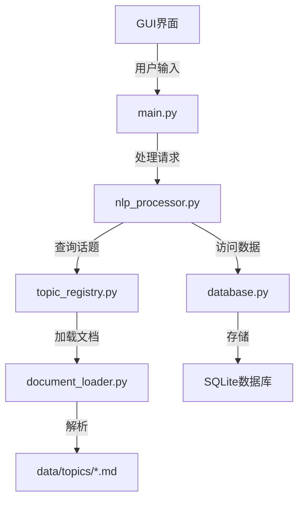
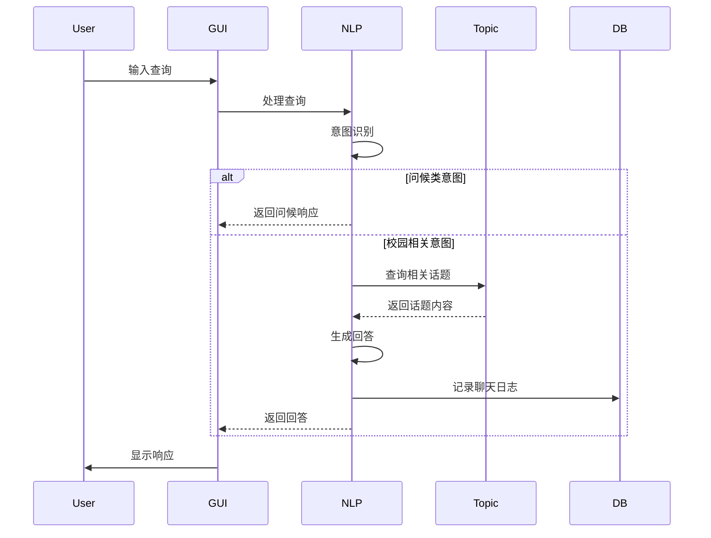
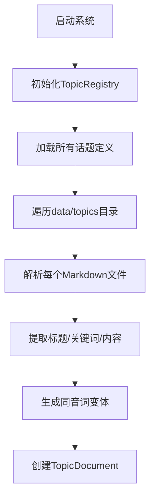

# 校园智能助手系统设计文档

## 1. 系统架构


## 2. 核心模块说明

### 2.1 main.py (GUI主程序)
- 功能：
  - 提供用户认证界面（登录/注册）
  - 话题选择界面
  - 聊天交互界面
  - 历史记录展示
- 技术：
  - 使用tkinter构建GUI
  - 采用MVC模式设计

### 2.2 nlp_processor.py (自然语言处理核心)
- 功能：
  - 意图识别（问候类/校园相关类）
  - 查询处理与回答生成
  - OpenAI API集成
- 关键类：
  - `Intent`: 意图识别结果
  - `NLPProcessor`: 核心处理逻辑

### 2.3 topic_registry.py (话题管理系统)
- 功能：
  - 管理预定义的校园话题
  - 加载话题内容文件
  - 提供话题查询接口
- 数据结构：
  - `TopicDefinition`: 话题元数据定义
  - `TopicRegistry`: 话题注册中心

### 2.4 document_loader.py (文档加载器)
- 功能：
  - 加载Markdown格式文档
  - 解析文档结构（标题/关键词/正文）
  - 生成同音词变体扩展查询
- 文档格式要求：
  ```markdown
  # 标题
  **关键词**: 关键词1、关键词2
  正文内容...
  ```

### 2.5 database.py (数据持久层)
- 功能：
  - 用户管理（创建/验证）
  - 聊天记录存储与查询
  - 用户偏好管理
- 数据库设计：
  - `users`表：用户信息
  - `chat_logs`表：聊天记录

### 2.6 models.py (数据模型)
- 核心模型：
  - `TopicDocument`: 表示话题文档数据
    - title: 文档标题
    - keywords: 关键词列表
    - content: 文档内容

## 3. 关键流程

### 3.1 用户查询处理流程


### 3.2 话题文档加载流程


## 4. 数据结构设计

### 4.1 TopicDefinition (话题定义)
```python
@dataclass
class TopicDefinition:
    display_name: str      # 显示名称
    keywords: List[str]    # 关联关键词
    data_file: str         # 数据文件路径
    description: str       # 话题描述
    content: str = ""      # 文件内容
```

### 4.2 TopicDocument (话题文档)
```python
@dataclass
class TopicDocument:
    title: str            # 文档标题
    keywords: List[str]   # 关键词列表
    content: str          # 文档内容
```

### 4.3 数据库表结构
```sql
-- users表
CREATE TABLE users (
    id INTEGER PRIMARY KEY,
    username TEXT UNIQUE NOT NULL,
    password_hash TEXT NOT NULL,
    preferences TEXT,
    created_at TIMESTAMP DEFAULT CURRENT_TIMESTAMP
);

-- chat_logs表
CREATE TABLE chat_logs (
    id INTEGER PRIMARY KEY,
    user_id INTEGER NOT NULL,
    query TEXT NOT NULL,
    response TEXT NOT NULL,
    timestamp TIMESTAMP DEFAULT CURRENT_TIMESTAMP,
    topic TEXT,
    FOREIGN KEY (user_id) REFERENCES users (id)
);
```

## 5. 扩展设计考虑

1. **多语言支持**：
   - 在document_loader.py中扩展同音词映射表
   - 在nlp_processor.py中添加多语言意图识别

2. **性能优化**：
   - 对高频查询结果添加缓存
   - 异步加载话题内容

3. **部署方案**：
   - 可打包为桌面应用(PyInstaller)
   - 或部署为Web服务(Flask/Django)