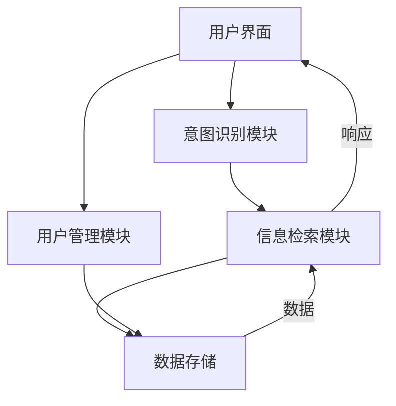

# 校园智能助手系统

[]()
[]()

## 项目概述
校园智能助手系统是一个基于AI的问答系统，专门为校园场景设计，旨在为学生提供一站式校园信息服务。系统整合了学术资源、生活服务、校园活动等10个类别的信息，通过自然语言交互提供智能问答服务。

## 技术栈
- Python 3.11+
- OpenAI API
- SQLite 数据库
- SQLAlchemy ORM
- Pytest 测试框架

## 系统架构


### 核心模块
1. **意图识别模块** (`intent_detection.py`)
2. **信息检索模块** (`retrieval.py`)
3. **用户管理模块** (`database.py`)
4. **数据模型** (`models.py`)

## 主要功能
- **用户管理**
  - 注册/登录/游客模式
  - 密码哈希存储(bcrypt)
  - 对话历史记录
- **校园信息智能检索**
  - 10个校园相关话题分类
  - 基于OpenAI的语义检索
  - 关键词匹配优化
- **多话题支持**
  - 学术资源(Academic Resources)
  - 基础生活服务(Basic Life Services)
  - 校园活动(Campus Activities)
  - 餐饮选项(Dining Options)
  - 校园导航(Campus Navigation)
  - 校园政策(Campus Policies)
  - 选课指南(Course Selection)
  - 重要联系方式(Contact Numbers)
  - 办事流程(Procedures)
  - 周边交通(Transportation)

## 核心模块

### 1. 主程序 (`main.py`)
```python
class CampusAssistant:
    """校园智能助手GUI主程序"""
    # 实现细节...
```
- **功能**:
  - 提供基于tkinter的图形用户界面
  - 处理用户登录/注册
  - 管理话题选择和聊天界面
  - 集成NLP处理和数据库功能
- **特点**:
  - 响应式UI设计
  - 支持游客模式和注册用户
  - 对话历史记录功能

### 2. NLP处理模块 (`nlp_processor.py`)
```python
class NLPProcessor:
    """处理自然语言查询"""
    # 实现细节...
```
- **功能**:
  - 意图识别(GREETING/SCHOOL_RELATED/UNKNOWN)
  - 处理问候类查询
  - 调用OpenAI API生成回答
  - 结合话题内容进行检索
- **依赖**: OpenAI SDK, topic_registry

### 3. 话题管理 (`topic_registry.py`)
```python
class TopicRegistry:
    """管理校园话题内容"""
    # 实现细节...
```
- **功能**:
  - 管理10个校园话题的定义
  - 加载和缓存话题内容
  - 提供话题检索功能
- **特点**:
  - 自动加载data/topics/下的Markdown文件
  - 支持关键词匹配话题

### 4. 数据库管理 (`database.py`)
```python
class DatabaseManager:
    """管理用户数据和对话历史"""
    # 实现细节...
```
- **功能**:
  - SQLite数据库存储
  - 用户认证与密码哈希(bcrypt)
  - 聊天记录存储
  - 用户偏好设置管理
- **特点**:
  - 使用bcrypt安全存储密码
  - 轻量级ORM实现

### 5. 话题定义 (`TopicDefinition`类)
```python
@dataclass
class TopicDefinition:
    """单个话题的定义"""
    # 实现细节...
```
- **属性**:
  - display_name: 显示名称
  - keywords: 关键词列表
  - data_file: 数据文件路径
  - description: 话题描述
  - content: 文件内容

## 文件结构
```
.
├── main.py                # 主程序入口
├── config.py              # 配置文件
├── database.py            # 数据库管理
├── document_loader.py     # 文档加载器
├── models.py              # 数据模型
├── nlp_processor.py       # NLP处理核心
├── topic_registry.py      # 话题管理
├── user_json.py           # 用户数据辅助
├── requirements.txt       # 依赖列表
├── README.md              # 项目文档
├── data/                  # 数据文件
│   ├── jieba_dict.txt     # 中文分词词典
│   └── topics/            # 校园主题文档
│       ├── Academic_Resources.md
│       ├── Basic_Life_Services.md
│       ├── Campus_Activities_and_Events.md
│       ├── Campus_and_Nearby_Dining_Options.md
│       ├── Campus_Navigation_and_Facilities.md
│       ├── Campus_Policies_and_Safety.md
│       ├── Course_Selection_Guide.md
│       ├── Important_Contact_Numbers.md
│       ├── Procedures_and_Processes.md
│       └── Surrounding_Transportation.md
└── tests/                 # 测试代码
    ├── test_database.py
    └── test_nlp_processor.py
```

## 安装指南

### 基础安装
1. 克隆项目仓库
```bash
git clone https://github.com/your-repo/campus-assistant.git
cd campus-assistant
```

2. 创建并激活虚拟环境 (推荐)
```bash
python -m venv venv
source venv/bin/activate  # Linux/Mac
venv\Scripts\activate     # Windows
```

3. 安装依赖
```bash
pip install -r requirements.txt
```

4. 配置环境变量
```bash
cp .env.example .env
# 编辑.env文件填写OpenAI API密钥等配置
```

### 开发模式安装
```bash
pip install -e .[dev]
```

## 运行系统
```bash
python main.py
```

## 测试
```bash
pytest tests/
```

## 依赖项
- openai>=1.0.0
- python-dotenv>=1.0.0
- bcrypt>=4.0.1
- sqlalchemy>=2.0.0
- pytest>=7.0.0 (测试)

## 数据库
使用SQLite数据库(`campus_assistant.db`)，包含：
- 用户表(users)
- 对话历史表(conversations)
- 主题文档表(topics)

## 使用示例

1. 启动系统
```bash
python main.py
```

2. 登录或使用游客模式
   - 注册用户: 输入用户名和密码
   - 游客模式: 直接点击"游客模式"按钮

3. 选择话题
   - 从10个校园话题中选择一个(如"学术资源")

4. 开始问答
   - 输入问题:"如何申请图书馆延期？"
   - 系统将返回详细的解答流程

5. 查看历史记录(仅登录用户)
   - 点击"查看历史记录"按钮查看过往对话

## 开发指南

### 添加新话题
1. 在`data/topics/`下创建新的Markdown文件
2. 在`topic_registry.py`的`_initialize_topics()`方法中添加新话题定义:
```python
"new_topic": TopicDefinition(
    display_name="新话题名称",
    keywords=["关键词1", "关键词2"],
    data_file="data/topics/新话题文件.md",
    description="话题描述"
)
```

### 修改UI样式
编辑`main.py`中的`CampusAssistant`类的样式配置部分:
```python
style.configure('TButton', 
    font=('微软雅黑', 12),
    foreground='white',
    background='#4a98f7'
)
```
```
