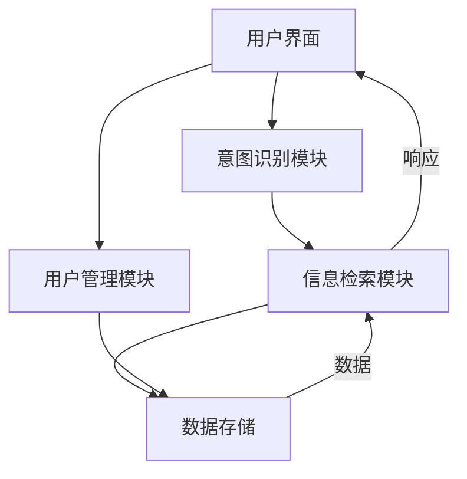

# 校园智能助手系统

[]()
[]()

## 项目概述
校园智能助手系统是一个基于AI的问答系统，专门为校园场景设计，旨在为学生提供一站式校园信息服务。系统整合了学术资源、生活服务、校园活动等10个类别的信息，通过自然语言交互提供智能问答服务。

## 技术栈
- Python 3.11+
- OpenAI API
- SQLite 数据库
- SQLAlchemy ORM
- Pytest 测试框架

## 系统架构


### 核心模块
1. **意图识别模块** (`intent_detection.py`)
2. **信息检索模块** (`retrieval.py`)
3. **用户管理模块** (`database.py`)
4. **数据模型** (`models.py`)

## 主要功能
- **用户管理**
  - 注册/登录/游客模式
  - 密码哈希存储(bcrypt)
  - 对话历史记录
- **校园信息智能检索**
  - 10个校园相关话题分类
  - 基于OpenAI的语义检索
  - 关键词匹配优化
- **多话题支持**
  - 学术资源(Academic Resources)
  - 基础生活服务(Basic Life Services)
  - 校园活动(Campus Activities)
  - 餐饮选项(Dining Options)
  - 校园导航(Campus Navigation)
  - 校园政策(Campus Policies)
  - 选课指南(Course Selection)
  - 重要联系方式(Contact Numbers)
  - 办事流程(Procedures)
  - 周边交通(Transportation)

## 核心模块

### 1. 意图识别模块 (`intent_detection.py`)
```python
def detect_intent(text: str) -> str:
    """识别用户意图"""
    # 实现细节...
```
- **功能**:
  - 使用正则表达式进行关键词匹配
  - 识别两类意图：问候/闲聊(GREETING)和学校相关问题(SCHOOL_RELATED)
  - SCHOOL_RELATED包含学业、校园服务、活动、生活等详细分类
- **依赖**: 正则表达式(re)

### 2. 信息检索模块 (`retrieval.py`)
```python
def retrieve_info(topic: str, query: str) -> str:
    """根据主题和查询检索信息"""
    # 实现细节...
```
- **功能**:
  - 基于OpenAI API的文档检索
  - 支持10个校园相关话题的智能检索
  - 包含话题匹配和关键词筛选功能
- **依赖**: OpenAI SDK

### 3. 用户管理模块 (`database.py`)
```python
class UserDB:
    """管理用户数据和对话历史"""
    # 实现细节...
```
- **功能**:
  - SQLite数据库存储
  - 用户认证与密码哈希(bcrypt)
  - 聊天记录存储
  - 使用SQLAlchemy ORM
- **依赖**: SQLAlchemy, bcrypt

### 4. 数据模型 (`models.py`)
```python
@dataclass
class TopicDocument:
    title: str          # 文档标题
    keywords: list[str] # 关键词列表
    content: str        # 文档内容
    qa_pairs: list[tuple[str, str]] # 问答对
```
- **用途**: 存储校园各主题的完整信息
- **特点**:
  - 支持多关键词检索
  - 包含详细内容和关联问答
  - 结构化存储便于检索处理

## 数据目录结构
```
data/
├── jieba_dict.txt       # 中文分词词典
└── topics/              # 校园主题文档
    ├── Academic_Resources.md
    ├── Basic_Life_Services.md
    ├── Campus_Activities.md
    ├── Campus_and_Nearby_Dining_Options.md
    ├── Campus_Navigation_and_Facilities.md
    ├── Campus_Policies_and_Safety.md
    ├── Course_Selection_Guide.md
    ├── Important_Contact_Numbers.md
    ├── Procedures_and_Processes.md
    ├── Surrounding_Transportation.md
```

## 安装指南

### 基础安装
1. 克隆项目仓库
```bash
git clone https://github.com/your-repo/campus-assistant.git
cd campus-assistant
```

2. 创建并激活虚拟环境 (推荐)
```bash
python -m venv venv
source venv/bin/activate  # Linux/Mac
venv\Scripts\activate     # Windows
```

3. 安装依赖
```bash
pip install -r requirements.txt
```

4. 配置环境变量
```bash
cp .env.example .env
# 编辑.env文件填写OpenAI API密钥等配置
```

### 开发模式安装
```bash
pip install -e .[dev]
```

## 运行系统
```bash
python main.py
```

## 测试
```bash
pytest tests/
```

## 依赖项
- openai>=1.0.0
- python-dotenv>=1.0.0
- bcrypt>=4.0.1
- sqlalchemy>=2.0.0
- pytest>=7.0.0 (测试)

## 数据库
使用SQLite数据库(`campus_assistant.db`)，包含：
- 用户表(users)
- 对话历史表(conversations)
- 主题文档表(topics)

## 使用示例
1. 启动系统后选择话题(如"学术资源")
2. 输入问题："如何申请图书馆延期？"
3. 系统将返回详细的解答流程和相关注意事项
```
