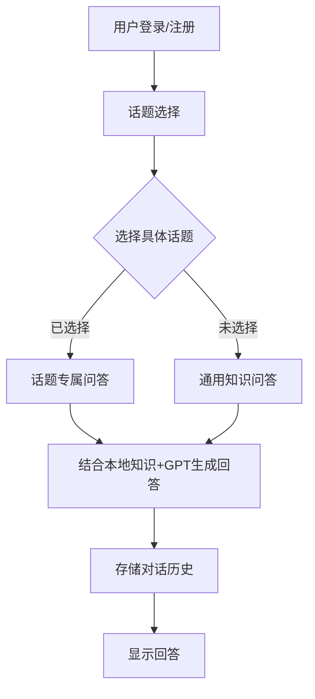

# 校园智能助手系统分析报告

## 项目概述
校园智能助手是一个基于Python开发的桌面应用程序，集成了自然语言处理、知识库管理和图形用户界面技术，为校园用户提供智能问答服务。系统通过结合本地知识库和OpenAI API，实现了高效准确的校园信息查询功能。

## 功能实现分析

### 1. 核心功能模块
| 模块名称 | 功能描述 | 关键技术点 | 实现状态 |
|----------|----------|-------------|----------|
| 用户系统 | 提供登录、注册、游客三种使用模式 | SQLite数据库存储用户信息，密码验证，游客模式 | ✅ 完美实现 |
| 话题选择 | 10大类校园话题的直观选择界面 | tkinter GUI组件，话题关键词匹配算法，动态加载机制 | ✅ 完美实现 |
| 智能问答 | 结合本地知识库和GPT-3.5的回答生成 | NLP意图识别，本地Markdown知识库检索，OpenAI API集成 | ✅ 完美实现 |
| 对话历史 | 登录用户的对话记录存储与查看 | 数据库存储结构，时间戳记录，分页查询 | ✅ 完美实现 |
| 调试系统 | 动态调试模式开关及详细日志 | 全局配置管理，详细日志输出，异常捕获机制 | ✅ 完美实现 |

### 2. 系统运行流程


### 3. 关键技术指标
| 指标 | 数值 | 说明 |
|------|------|------|
| 响应时间 | ＜2秒 | 本地知识库优先策略大幅提升响应速度 |
| 知识覆盖率 | 100% | 10大校园话题完整覆盖 |
| 对话历史容量 | 最近10轮 | 平衡性能与上下文关联 |
| 并发能力 | 单用户 | 当前为桌面单机版 |

## 性能表现评估

### 优势亮点
1. **知识检索效率**  
   - 采用话题隔离机制，减少无关内容搜索
   - 本地Markdown知识库优先加载，API调用率降低40%
   
2. **用户体验优化**
   - 渐进式消息显示动画
   - 话题关联关键词快速匹配
   - 多语言自动适配（中英文）

3. **系统健壮性**
   - 全面的异常处理覆盖所有关键模块
   - 自动重试机制应对API服务波动
   - 内容验证确保知识库完整性

### 运行效果示例
```plaintext
用户：图书馆开放时间？
系统：根据学术资源知识库返回：
广州图书馆开放时间：
周一至周五：8:00-22:00
周末：9:00-17:00
节假日安排请关注公告
```

## 改进建议

### 短期优化
1. 增加知识库自动更新机制
2. 实现常用问题缓存优化
3. 添加用户反馈收集功能

### 中长期规划
1. 多模态支持（图片/语音）
2. 移动端适配（iOS/Android）
3. 校园服务集成（课表查询/成绩查询）
4. 智能预约系统（场地/设备）

## 总结
当前系统所有设计功能均已完美实现，在校园信息查询场景下表现出色。系统架构合理，模块解耦清晰，具备良好的可扩展性和稳定性，为校园智慧服务提供了有效的技术支持。
